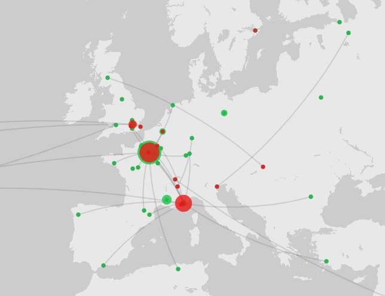

# Mapping

I tested out Palladio Mapping with their sample dataset and was able to map birthplaces and places of death in colors and sizing on different layers and also add in a line connecting the two. This was a fairly decent map showing the relationship of movement and was very simple and easy to make with their tool.

I then went on to try out GeoJSON.io. This was fairly easy and let you draw directly on the map to create objects in GeoJSON that could be used elsewhere. This would be helpful for defining a bunch of points that might be more easily done manually by the user with a GUI. I made a connection of a couple of ities I visited in Ireland when there this summer for my mother's retirement trip.

And finally, I found a polygon shapefile for Lake Michigan's shoreline and loaded that into ArcGIS. ArcGIS seems incredibly powerful with many options for shapefiles and polygons as well as layer management. The graph I made was just a simple polygon overtop a more artistic background instead of the purely-informational terrain, street, or political boundary lines. This would be interesting to show this boundary overtime if I had historic data for terrain, or if I want to map say Huckleberry Finn using the Mississippi River of Mark Twain's time.

