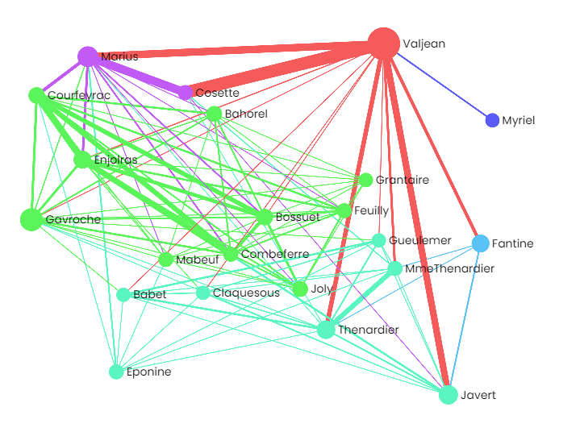
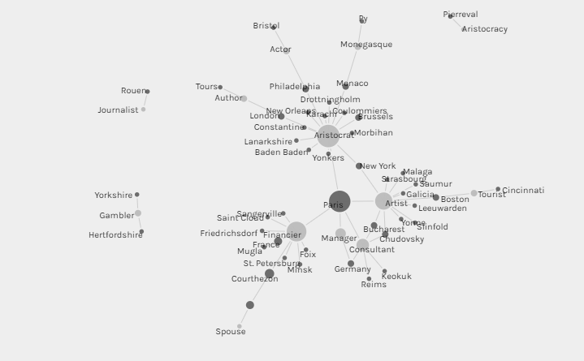

# Network Analysis

I first tried out Gephi Lite and it took a bit to get used to with how to calculate the metrics and use the interface. I feel like with a bit more control over the initial data this would be a very useful tool. I attempted to see if I could gather any insights with the Java graph, but even with filtering and stats, the data was highly connected and difficult to interpret. I then switched to the Les Miserables graph, which was very interesting. None of the layout algroithms really got down to what I was looking for. But by filtering to nodes with degrees greater than 10, I had a smaller number of people that I was able to manually cluster. I was also able to change the edge to the color of the target node, which helps with differentiating the paths between characters.

Then switching on over to Palladio, I used the test dataset there to see what was doable. I feel like this has much more potential as a mapping tool, but the graph capabilities were interesting. Gephi was definitely better in terms of features, but Palladio was able to plot the data in a meaningful way. Here I looked at the occupation and location of those in this graph. It showed primary cities for centrality and key job classes for what I were artists. There were also interested separated graphs.

