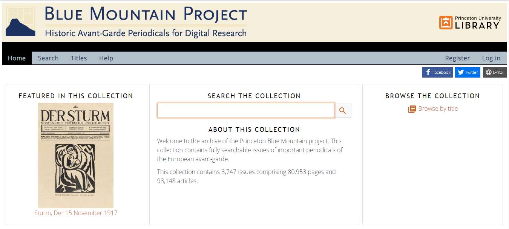
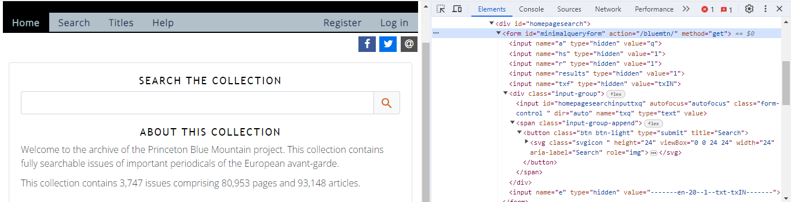
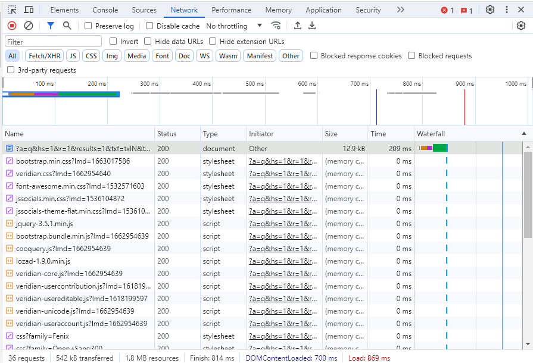

# Minimal Computing

I am evaluating Princeton Library's Blue Mountain Project. The project digitized issues of important periodicals of the European avant-garde and made them fully text searchable. The collection contains 3,747 issues comprising 80,953 pages and 93,148 articles.

URL: [https://bluemountain.princeton.edu/bluemtn/](https://bluemountain.princeton.edu/bluemtn/)

When I open the page, there is a website that appears, so at a minimum there is HTML and CSS in use here for this page.

At the bottom right of the page I notice the words "Powered by Veridian". Following the link to [Veridian](https://veridiansoftware.com/) shows that they are a software company that creates content management systems designed for digital humanities, specifically for digitized archives and collections.

Looking again at the main homepage, and clicking inspect-element on the search bar, I find that the search bar is a HTML form field with a submit button. This means that when I click the button, I am directed to a new page with my query in the HTTP request to load the new page. This means that the website is doing some preprocessing on the server-side to load the page before handing it off, but we can keep looking.

I switched the developer tools bar to the network tab so that my browser would track all of the requests that the website would send. Once there, I searched for "death" in the form. This lead to a new page in the URL (based on the HTML form GET submit button). The page had some parameters in the URL that specified the search criteria. URL: [https://bluemountain.princeton.edu/bluemtn/?a=q&hs=1&r=1&results=1&txf=txIN&txq=death&e=-------en-20--1--txt-txIN-------](https://bluemountain.princeton.edu/bluemtn/?a=q&hs=1&r=1&results=1&txf=txIN&txq=death&e=-------en-20--1--txt-txIN-------) has the txq parameter equal to "death" which is what I searched for. Additionally in the network tab there is loading of CSS, JavaScript, and Image, but there are no other API calls that occur, which further suggests that this is a server compiling the HTML that I am viewing (as opposed to a static HTML site or a static site with JavaScript to load and create content). Looking at the "Veridian-Core.JS" shows that the underlying JavaScript is not minified and is written with JQuery, which makes usage of any JS framework unlikely.

All in all, this is a moderately small webpage at 542kB and does not require the end user render the full webpage.

Looking at the September 1916 issue of Der Sturm, the size of the network traffic quickly reached 1MB, which for most people is not an unreasonable size. Broadband minimal speeds of 25 Mbps can still easily get these archive materials, and even average DSL speeds of 10 Mbps are still happy with retrieving and displaying this content.

- From a digital accessibility standpoint, I think this site meets the goals of minimal computing since the end-user requirements are limited.
- From a maintenance perspective, this webpage looks like it requires funding from Princeton's library to maintain their contract with Veridian's content management system. Additionally they would also need to pay technical people to host the CMS internally or pay an external service to manage all of the changes. This does not meet some people's definition of "minimal computing" since it requires continued maintenance of servers and code. I would say that as long as the work is recognized, this can meet the goals of minimal computing.
- Finally, the collection is text searchable which is an additional computation, but this layer of computing provides new avenues for discoverability, which I think is a reasonable tradeoff and is part of what makes this a digital collection.